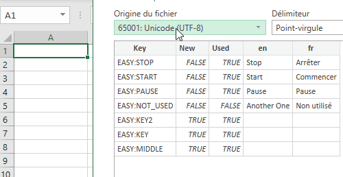

[](https://www.npmjs.com/package/@creadigme/au-i18n-audit)
[](https://github.com/creadigme/aurelia-i18n-audit/actions/workflows/ci.yml)
[](https://github.com/creadigme/aurelia-docgen/actions/workflows/codeql-analysis.yml)
[](https://codecov.io/gh/creadigme/aurelia-i18n-audit)
[](LICENSE)
<br />

# Aurelia I18N Audit

Aurelia I18N Audit brings more control over your translations. With the integrated CLI you can check if all your translations keys are used, more importantly, you will be able to find the ones that are not defined.

This tool is intended to be used with projects based on [Aurelia framework](https://aurelia.io/) + [i18next](https://www.i18next.com/). It could also work with projects using only  [i18next](https://www.i18next.com/).

[](https://aurelia.io/)

<a href="https://www.i18next.com/" target="_blank"></a>

## 📝 License

[The MIT License](LICENSE) - Copyright © 2022 [Creadigme](https://www.creadigme.net).

Do not hesitate to [contact us](https://creadigme.net/contact/).

## 💾 Installation

```shell
yarn add @creadigme/au-i18n-audit -D
# or
npm i @creadigme/au-i18n-audit --save-dev
```

## ⚙ CLI parameters
  
| Parameter | Description | Sample | Mandatory | Multiple
|---|---|---|---|---|
| --src | Sources directory *(js, ts or html)* | `./src/` | true | true
| --i18n | i18n files directory *(json or yml)* | `./i18n/` | false<sup>1</sup> | true
| --remote-i18n | i18n backend | `http://localhost:8085/i18n/{{ns}}/{{lang}}` | false<sup>1</sup> | true
| --reporter | Reporter : [`summary`](#summary), [`text`](#text), [`csv`](#csv), [`xls`](#excel) | `summary` | false | true
| --output | Directory or file path of report (*only used with reporter `csv` and  `xls`*) | `./i18n_report/` | false | false
| --level | Figure out if we finish with 0 code error or 1 (see Level bellow) | false | false
| --lang | Language | `en` | false | true
| --namespace | Namespace | `cart` | false | true
| --namespace-sep | NS separator (default `:`) | `$` | false | false
| --nested-sep | Sub key separator (default `.`) | `~` | false | false
| --default-ns | Default namespace (default `translation` or the first namespace)  | `easy` | false | false
| --ignore-keys | Provide the ability to ignore specific keys | `^(shop\|other)\\.` | false | false
| --discovery | Provide the ability to discover i18n keys everywhere (you must provide `--namespace` & `--lang`) | | false | false

---

1. `--i18n` or `--remote-i18n` must be specified (or both).

---

| Level | Description 
|---|---|
| `1` | Easy: just have all languages ok
| **`2`** | Medium: no missing keys & all languages ok (default)
| `3` | Hard: no missing keys && no unused keys & all languages ok

## Usage

### Local I18N

1. Check the directories of your project, example :

i18n with a specific file per namespace (`--i18nMode tree`):

```shell

├── i18n
│   ├── fr
│   │   ├── NS1.{yml,yaml,json}
│   │   └── NS2.{yml,yaml,json}
│   └── en
│       ├── NS1.{yml,yaml,json}
│       └── NS2.{yml,yaml,json}
└── src
    ├── file1.{js,ts}
    ├── file2.{js,ts}
    └── file3.{js,ts}

```

i18n with a specific file for each language (`--i18nMode root`):

```shell

├── i18n
│   ├── fr.{yml,yaml,json}
│   └── en.{yml,yaml,json}
└── src
    ├── file1.{js,ts}
    ├── file2.{js,ts}
    └── file3.{js,ts}

```

2. Add i18n script

```diff
"scripts": {
+  "i18n" : "au-i18n-audit --src ./src/ --i18n ./i18n --i18nMode tree --reporter summary"
!  "i18n" : "au-i18n-audit --src ./src/ --i18n ./i18n --i18nMode root --reporter summary"
}
```

3. Launch i18n script

```shell
yarn i18n
# or
npm run i18n
# [i18n] @creadigme/au-i18n-audit v0.8.0.
# [i18n] 2 languages detected (en, fr).
# [i18n] 132 keys seems not to be used (maybe server side?).
# [i18n] 21 keys are not defined.
# [i18n] 1 keys do not have all the languages translated.
```

### Remote I18N

You must provide:
- `--remote-i18n` of your i18n backend, with `{{ns}}` and `{{lang}}`.
Example: `http://localhost:8085/i18n/{{ns}}/{{lang}}`
- `--namespace` for iterate over your namespaces.
- `--lang` for iterate over your languages.


```json
"scripts": {
  "i18n" : "au-i18n-audit --src ./src/ --remote-i18n http://localhost:8085/i18n/{{ns}}/{{lang}} --namespace NS --lang en --lang fr --reporter summary"
}
```


### API

```typescript
import { I18NAudit } from '@creadigme/au-i18n-audit';

async () => {
  const audit = new I18NAudit({
    srcPaths : [path.resolve(".\\src")],
    local : {
      i18nPaths : [path.resolve(".\\i18n")]
    }
  });

  await audit.initializeAsync();
  const details = await audit.validateAsync();

  console.log(details.isOk);
}();
```

## 📝 Reporters

### Summary

> `--reporter summary`


### Text

> `--reporter text`


*:information_source: The paths to the sources (rows, columns) are clickable under Visual Studio Code.*

### CSV

> `--reporter csv`




*:information_source: The default folder is the working directory. Use `--output` to specify another one or a filename  (`xx.csv`).*


### Excel

> `--reporter xls`


*:information_source: The default folder is the working directory. Use `--output` to specify another one or a filename (`xx.xlsx`).*